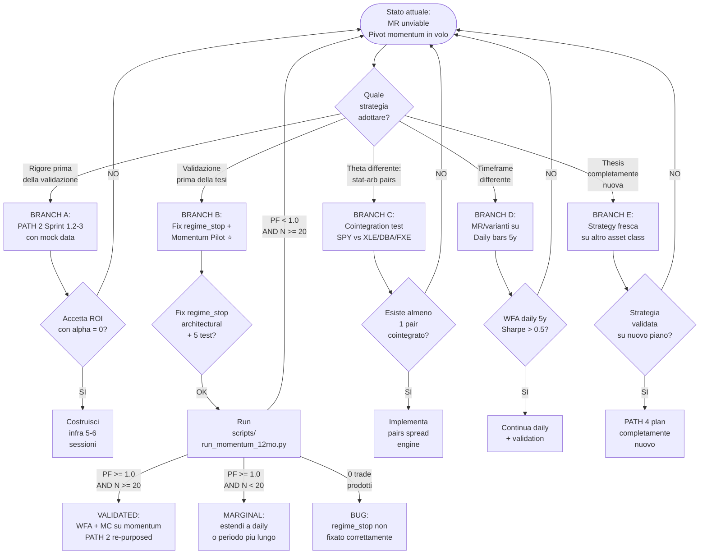

# Decision Tree — Strategic Pivot (2026-07-07)

**Data:** 2026-07-07
**Stato MR:** ruled out data-driven (5 finestre × PF<1)
**Stato PATH 3 (momentum):** mid-implementation, architectural bug noto e fifable

---

## 1. Decision Tree Visuale (Mermaid)

---

## 2. Branch Analysis Matrix

| Branch | Effort | Acceptance Gate | Decision Rule | Failure Mode |
|---|---|---|---|---|
| **A. PATH 2 mock** | 5-6 sessions | infra non crasha, metriche placebo | ultima risorsa; alpha=0 | overhead cognitivo alto, test fragili |
| **B. Fix + Momentum pilot** ⭐ | 1-2 sessions | PF >= 1.0, N >= 20 trade | architectural bug subito fixable; validazione necessaria prima di WFA | 0 trade = architectural fix non reale |
| **C. Pairs universo espanso** | 8+ sessions | almeno 1 pair coint p<0.05 | dopo momentum failure, prima di abbandonare equity-index | richiede ETL nuovo |
| **D. Daily timeframe** | 1 session | WFA Sharpe 5y > 0.5 | se momentum fallisce in intraday | pochi trade/anno intraday limitato |
| **E. Strategy nuova** | open | thesis fresh | fallimento totale di A/B/C/D | tempo + costo elevato |

---

## 3. Decision Rules per ogni branch

### BRANCH A — Continua PATH 2 con Mock Data

- **Effort stimato:** 5-6 sessioni (Sprint 2 WFA + Sprint 3 MC).
- **Quando si prende:** solo se TUTTE le strategie intraday sono ruled out (Post-FAIL globale).
- **Gate di accettazione:** Portfolio backtest + WFA non crashano; metriche placebo estratte su mock data.
- **Trade-off chiave:** rigore formale massimo, MA feedback information-to-action = 0;
  l'infrastruttura non è testata in stress conditions reali, quindi eventuali bug
  di portfolio (skip_reasons, MTM) emergono solo dopo deploy.

### BRANCH B — Fix PATH 3 Momentum Pivot (RACCOMANDATA)

- **Effort stimato:** 1-2 sessioni.
- **Quando si prende:** subito, perché:
  1. Test failures sono causate da un singolo bug architetturale noto e fixable in <1 sprint.
  2. Tesi momentum ha premesse ragionevoli (Donchian breakout su 15-min trending instruments).
  3. Se validata, si entra in PATH 2 con dati reali (alto leverage rispetto al mock).
- **Gate di accettazione pilot:** PF >= 1.0 E N >= 20 trade su SPY 12mo.
- **Extension gate:** PF >= 1.0 ma N < 20 → considera daily timeframe (BRANCH D-like).
- **Failure gate:** PF < 1.0 o 0 trade → momentum non viable → pivot a BRANCH C/E.

### BRANCH C — Pairs Trading su Universo Espanso

- **Effort stimato:** 8+ sessioni (cointegration test + spread engine + Kalman hedge ratio + portfolio).
- **Quando si prende:** dopo momentum failure, prima di abbandonare equity-index framework.
- **Gate preliminare (rapido, ~1 sessione):** Engle-Granger / Johansen test su candidate pairs SPY vs XLE, DBA, FXE, UUP; selezionare pairs con p<0.05 E rolling persistence >60% E half-life <30 bars.
- **Se nessun pair è viable:** BRANCH E (strategy nuova) → abbandono equity-index.

### BRANCH D — Switch Timeframe (Daily MR)

- **Effort stimato:** 1 sessione (configurazione: timeframe=1Day, indicators rangebigger, regime filter=ADX<20 daily).
- **Quando si prende:** momentum failure come ultima prova intraday-sufficiency prima di cambiare instrument/decade.
- **Gate:** WFA daily 5y produce Sharpe > 0.5 con N > 20 trade/anno.
- **Trade-off:** meno rumore intraday, MA anche meno trade; MC con low_confidence persistente.

### BRANCH E — Strategia Completamente Nuova

- **Effort stimato:** open (nuovo PATH 4 plan).
- **Quando si prende:** fallimento totale di B/C/D in ≤ 1 mese di iterazioni.
- **Decisione:** strategia su classe asset diversa (commodities, FX, crypto, bonds) o filosofia diversa (volatility trading, market-neutral stat-arb).

---

## 4. Raccomandazione

**Default branch:** **BRANCH B** — Fix regime_stop architectural + Momentum Pilot.

### Motivazione (evidence-based)

1. **Costo minimo, ROI massimo atteso.** I 5 test failures sono causati da un singolo bug architetturale (~10 LOC fix). Se il fix funziona, si ottiene un pilot momentum con dati VIVI — alto leverage verso BRANCH A (PATH 2 WFA) e BRANCH C (pair espanso) futuri.
2. **Tesi ragionevole.** La mean-reversion è morta su 15-min intraday equity-index SPY, ma il momentum è una **thesis diversa**: presuppone trend continuations, non contrarian. Backtest su SPY 12mo in regime trending (Q4 2025) è il test perfetto perché abbiamo UN regime in cui la MR ha fallito che è ESATTAMENTE il regime dove momentum DEVE funzionare.
3. **Fail-fast iteration.** 1 sprint di effort, output binario (PF > 1 oppure no). Se FAIL, abbandoniamo equity-index intraday senza ambiguità. Se PASS, proseguire con WFA su momentum.

### Failure modes (worst case planning)

- **Pilot produce 0 trade:** architectural fix non reale; debugging regime_stop su dati reali.
- **Pilot produce PF > 1 ma N < 20:** statistica insufficiente; estendere a daily + multi-symbol aggregation per N multiplication.
- **Pilot produce PF < 1:** momentum non cattura edge in 15-min SPY → BRANCH C o E.
- **Pilot produce trade di alta qualità ma PF ~1:** borderline; considerare timeframe monthly vagy diversification multi-asset.

---

## 5. Trade-off fra branches (peso su alpha e tempo)

| Branch | Alpha atteso | Tempo | Costo cognitivo |
|---|---|---|---|
| A | 0 | 5-6 | alto (mock data mental overhead) |
| **B** ⭐ | **alto (se validata)** | **1-2** | **basso (bug noto, fixato)** |
| C | medio-alto | 8+ | medio |
| D | basso-medio | 1 | basso |
| E | molto alto o zero | open | molto alto |

---

## 6. Sequence flow

1. **Subito:** BRANCH B Sprint 1 (architectural fix + 5 test fix + hygiene refactor + pilot run).
2. **Sprint 2 (conditional):** brama dipendente dall'esito del pilot momentum.
   - Se PF >= 1 + N >= 20 → entra in PATH_2 WFA/MC (re-purposed per momentum).
   - Se failure → BRANCH C (cointegration espanso) o BRANCH D (daily).

---

## 7. References

- `analysis/strategy-fit.md §10-11` — diagnostica mean-reversion
- `analysis/PROJECT_STATUS_2026_07_07.md` — synthesis con timeline dettagliata
- `PATH_2_VALIDATION_INFRASTRUCTURE_PLAN.md §15` — regime check 2022/2023 result
- `analysis/cointegration_*.json` — pairs check on SPY/QQQ/IWM (NO viable)
- `analysis/regime_predictive_*.json` — filter counter-predictive finding
- `analysis/NEXT_DEV_PLAN_2026_07_07.md` — piano operativo dettagliato per BRANCH B
